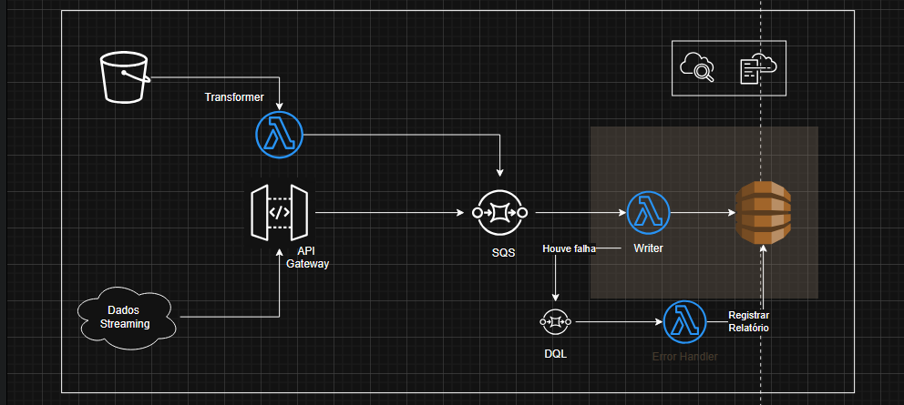

# Aplicação Serverless em Go

## 1. Visão Geral

Este projeto implementa  uma aplicação **serverless** utilizando **AWS Lambda (Go 1.23)**, **SQS**, **DynamoDB**, **S3** e **API Gateway**, orquestrado via **AWS SAM (Serverless Application Model)**.
O objetivo é processar dados de forma escalável, garantindo resiliência contra falhas e flexibilidade para diferentes fontes de entrada (streaming e upload em bucket).

---

## 2. Fluxo de Arquitetura

  

O fluxo segue o diagrama representado acima:

1. **Entrada de Dados**

   * Dados chegam via **S3 (uploads)** ou via **API Gateway (streaming / requisições REST)**.
   * A API Gateway publica diretamente mensagens no **SQS (WriterQueue)**.
   * O bucket S3 recebe uma arquivo `.json`, que dispara eventos para a função **Transformer**.

2. **Transformação**

   * A função **Transformer** (Go) normaliza/transforma os dados recebidos e envia mensagens para a fila **WriterQueue (SQS)**.

3. **Processamento**

   * A função **Writer** consome mensagens da fila, processa os registros e grava os resultados na **DynamoDB (AccountTable)**.

4. **Tratamento de Falhas**

   * Mensagens que falham no processamento após 1 tentativa são enviadas para a **DeadLetterQueue (DLQ)**.
   * A função **Error Handler** processa a DLQ e registra os erros em uma tabela separada no DynamoDB (**LogTable**).

5. **Monitoramento e Observabilidade**

   * Alarmes do **CloudWatch** monitoram erros das funções.
   * Logs são enviados para o **CloudWatch Logs**.
   * Um painel para visualização também foi definido para melhor acompanhamento do sistema

---

## 3. Componentes Principais

* **Lambdas (Go 1.23, compiladas com SAM CLI):**

  * **TransformerFunction:** Recebe eventos do S3, transforma e envia para SQS.
  * **WriterFunction:** Consome da fila, grava no DynamoDB, com canary deployment e alarmes.
  * **ErrorHandlerFunction:** Consome a DLQ, registra relatórios de erro no DynamoDB.

* **Mensageria:**

  * **WriterQueue (SQS):** Fila principal para orquestração.
  * **DeadLetterQueue (DLQ):** Mensagens não processadas.

* **Armazenamento:**

  * **AccountTable (DynamoDB):** Armazena dados processados.
  * **LogTable (DynamoDB):** Armazena relatórios de erro.
  * **DataBucket (S3):** Origem dos dados (uploads).

* **Exposição via API:**

  * **API Gateway (HTTP API):** Endpoint POST `/writer` que publica diretamente no SQS.

---

## 4. Tecnologias e Ferramentas

* **Linguagem:** Go 1.23
* **Framework:** AWS SAM CLI
* **Serviços AWS:** Lambda, SQS, DynamoDB, S3, API Gateway, CloudWatch
* **Deploy:** Infra como código via `template.yaml` (CloudFormation + SAM)
* **Estratégia de Deploy:** Canary Deployment (10% em 5 min)

## Link: 
- [AWS SDK para Go](https://aws.amazon.com/pt/sdk-for-go/)
- [SDK Referências - Github](https://pkg.go.dev/github.com/aws/aws-sdk-go-v2/service/lambda)